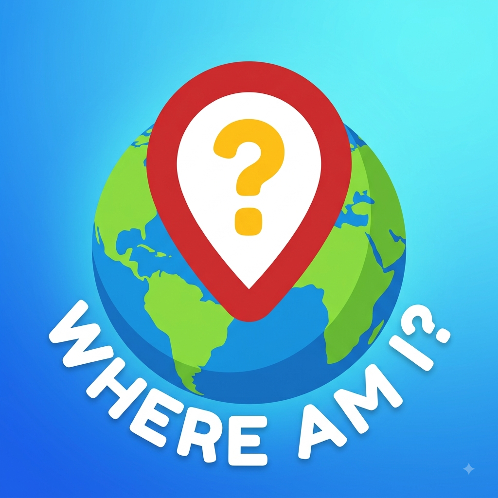
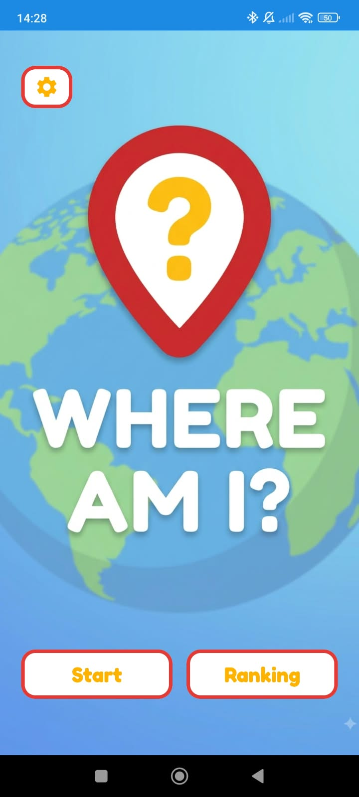
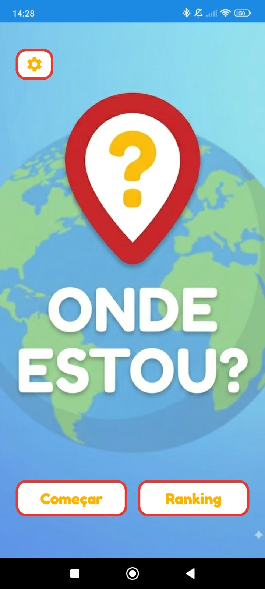
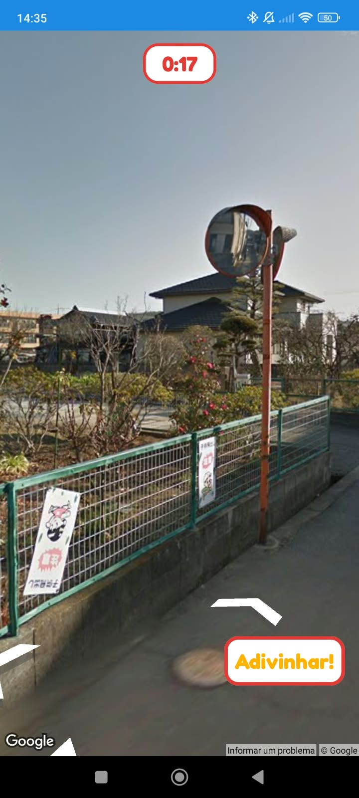
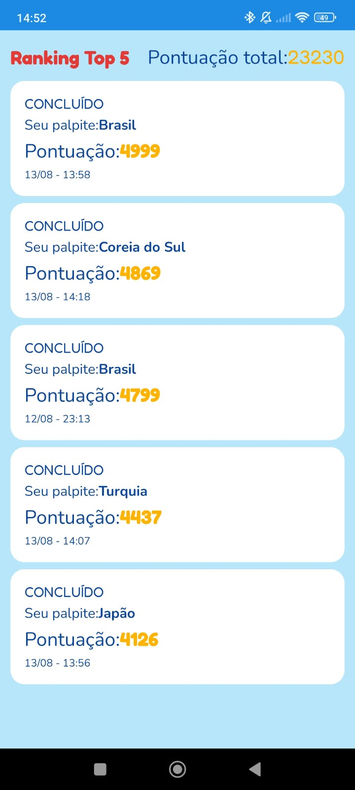
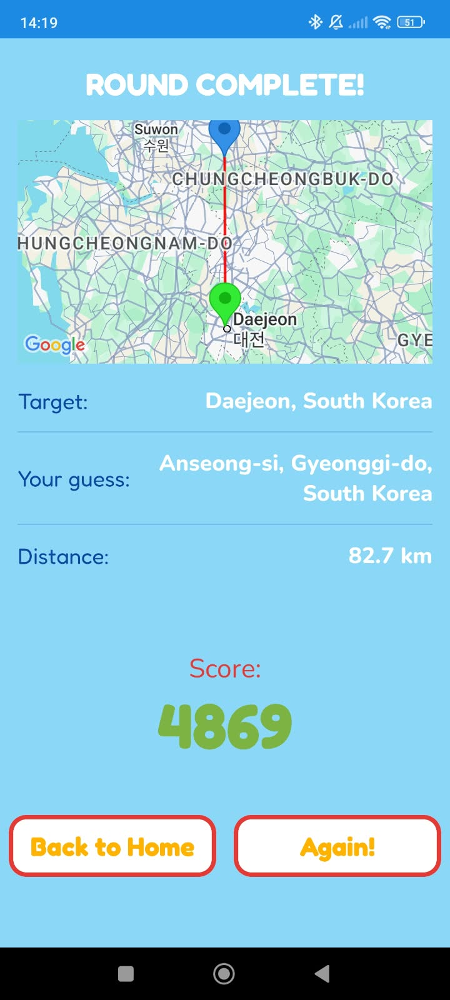
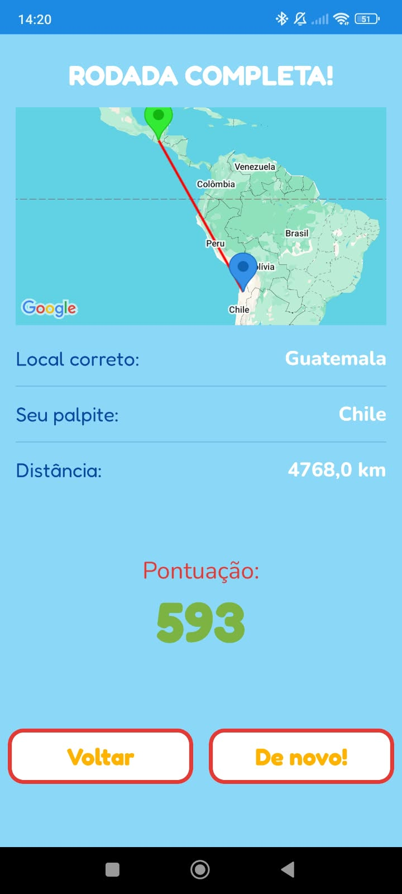
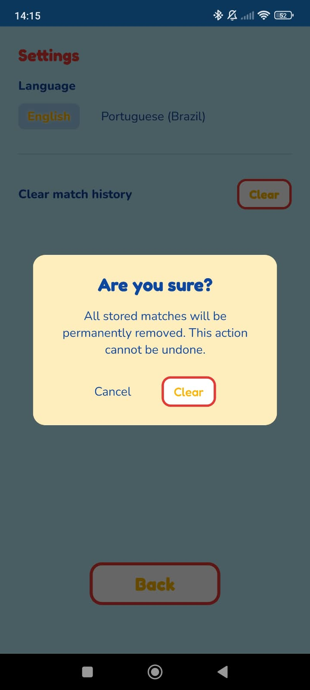
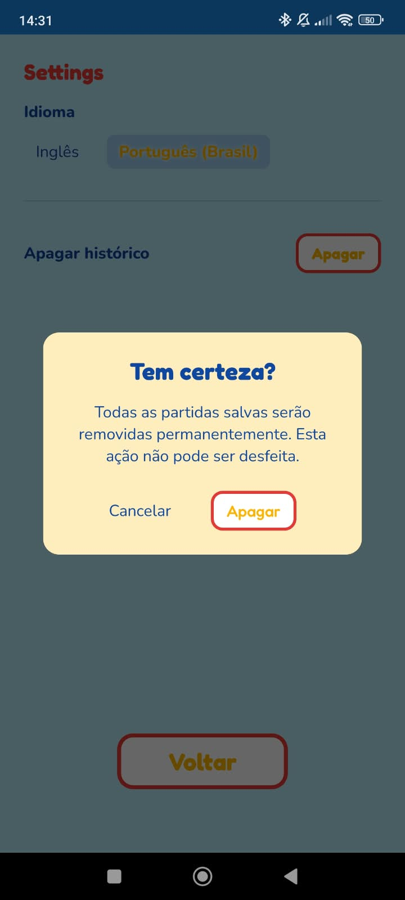

# 🌍 Where Am I❓

<p align="center">
  
</p>

A geography guessing game for Android built with Jetpack Compose.

## 📝 What is it❓

**Where Am I?** is a mobile geography game with full support for English and Portuguese (Brazil). 

The player is dropped into a Google Street View panorama somewhere in an inhabited city and has a few minutes to explore the surroundings. 

The goal is simple: figure out where you are and place a guess on a Google Map.

The closer the guess, the higher the score — but speed also matters! The faster you lock in, the more time bonus you keep. And if your guessed country matches the target country, you get an extra country bonus. 

All matches are stored locally, so you can always come back to beat your own record.


## 🛠️ What stack is it build on❓

| Category | Technology |
|----------|------------|
| Language | Kotlin 1.9.24 |
| Build System | Gradle 8.9 (AGP) |
| UI | Jetpack Compose + Material3 |
| Architecture | MVVM + Clean Architecture |
| Navigation | Jetpack Navigation Compose |
| Dependency Injection | Hilt 2.51.1 |
| Local Storage | Room 2.6.1 |
| Concurrency | Kotlin Coroutines + Flow |
| Networking | Retrofit 2.11.0 + OkHttp 4.12.0 + Gson |
| Maps & Location | Google Play Services Maps 19.0.0 & Location 21.3.0 |
| Testing | JUnit 4, Mockito, Turbine, Espresso |
| i18n | Built-in English (en) and Portuguese Brazil (pt-rBR) support |

## 📸 How about some game screenshots❓

### Home

<p align="center">
  
  &nbsp;&nbsp;
  
</p>

The app's entry point. From here the player can start a new match or open the ranking to review the top 5 best matches and their total score. Also from here the player can access the settings screen.

### Street View

<p align="center">
  
  &nbsp;&nbsp;
  
</p>

The player is placed inside a Street View panorama in a randomly selected city and has **150 seconds** to explore the surroundings and figure out the location. When the timer drops to **25 seconds or less**, the bar turns red — time to stop sightseeing and make a call!

### Ranking

<p align="center">
  
  &nbsp;&nbsp;
  
</p>

Bragging rights, anyone? The ranking keeps your **top 5 best matches** and the combined total score from those runs. Each card tells the story of a round: your guess, the distance to the target, and the final score. It is perfect for comparing sessions or proving to friends that you really can tell one beach from another just by the sidewalk. 

### Result Screen

<p align="center">
  
  &nbsp;&nbsp;
  
</p>

This is the moment of truth! The result screen reveals the real target, your guess, and the distance between them on a mini map. The score is built from three ingredients:

- **Precision**: the closer your marker is, the more points you get.
- **Speed**: the more time left on the clock, the bigger your time bonus.
- **Country bonus**: guess the right country and you get an extra reward.

A nice little detail: when the guessed country matches the target, the screen shows the full city and address. When it does not, you see only the country — a quick hint to where you almost were.

### Settings

<p align="center">
  
  &nbsp;&nbsp;
  
</p>

Need a fresh start? The settings screen lets you switch between **English** and **Portuguese (Brazil)** on the fly, so the whole game (buttons, labels, screenshots, and even map place names) follows your chosen language. You can also clear your match history to wipe the slate clean.


## 🏗️ And which patterns it uses❓

- **Clean Architecture**: separation between `domain`, `data`, and `presentation` layers.
- **MVVM**: each screen has a `ViewModel` exposing UI state through Compose `State`.
- **Repository Pattern**: `MatchRepository` and `SeedRepository` abstract data sources.
- **Use Cases**: business rules such as `CalculateScoreUseCase`, `GetRandomLocationUseCase`, and `SaveMatchUseCase` are isolated, single-responsibility units.
- **Dependency Injection**: Hilt modules in `data/di` provide abstractions over concretes.
- **Single Source of Truth**: Room database is the single source for match history and weekly score.

## 🚀 So, how do I install it❓

### Prerequisites

- Android Studio Hedgehog or later
- JDK 17
- Android SDK 34
- A Google Maps API key with Street View and Maps SDK enabled

### Steps

1. Clone the repository:

   ```bash
   git clone https://github.com/username/where-am-i.git
   cd where-am-i
   ```

2. Configure your Google Maps API key in `local.properties`:

   ```properties
   MAPS_API_KEY=your_api_key_here
   ```

3. Build the project:

   ```bash
   ./gradlew build
   ```

4. Run on a device or emulator:

   ```bash
   ./gradlew :app:installDebug
   ```

## ▶️ Is it easy to play❓

1. Open the app and tap **Start** on the Home screen.
2. Explore the Street View panorama to find clues — license plates, vegetation, sun position, anything goes!
3. Tap the guess action to open the map and drop your marker where you think you are.
4. Tap **I know where I am!** to lock in your guess and see the result.
5. Check the **Ranking** screen to review your best matches and total score.

## 🍵 Great, how about a tea or just exchange a few words❓
Find me anywhere @_sysout
