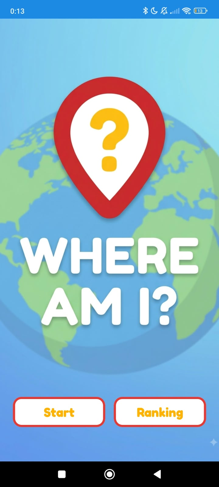
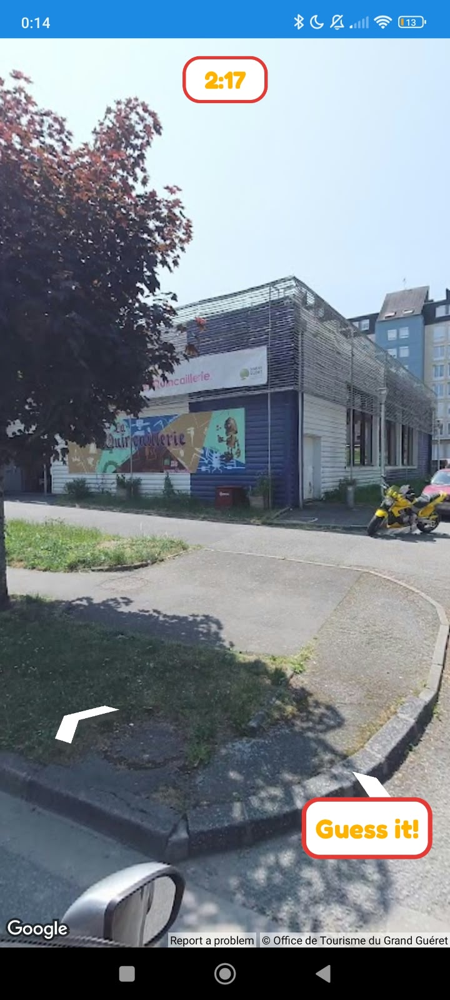
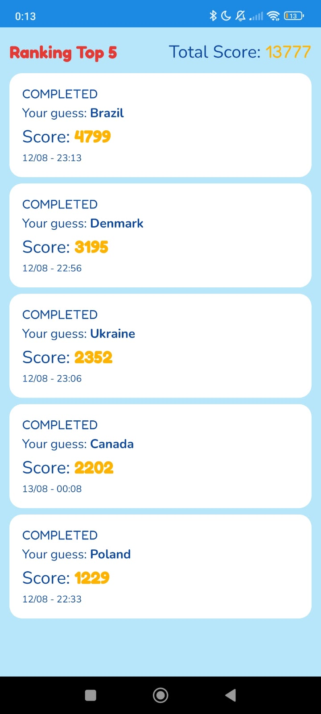
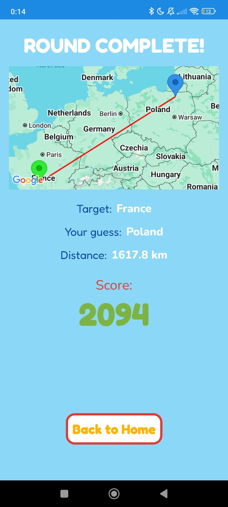

# 🌍 Where Am I❓


A geography guessing game for Android built with Jetpack Compose.

## 📝 What is it❓

**Where Am I?** is a mobile geography game where the player is dropped into a Google Street View panorama somewhere in an inhabited city. The goal is simple: figure out where you are and place a guess on a Google Map. The closer the guess, the higher the score. The game also rewards the player when the guessed country matches the target country.

The app stores every match locally and provides a ranking/history screen to review past results.

## 🛠️ What stack is it build on❓

| Category | Technology |
|----------|------------|
| Language | Kotlin 1.9.24 |
| Build System | Gradle 8.5.2 (AGP) |
| UI | Jetpack Compose + Material3 |
| Architecture | MVVM + Clean Architecture |
| Navigation | Jetpack Navigation Compose |
| Dependency Injection | Hilt 2.51.1 |
| Local Storage | Room 2.6.1 |
| Concurrency | Kotlin Coroutines + Flow |
| Networking | Retrofit 2.11.0 + OkHttp 4.12.0 + Gson |
| Maps & Location | Google Play Services Maps 19.0.0 & Location 21.3.0 |
| Testing | JUnit 4, Mockito, Turbine, Espresso |

## 📸 How about some game screenshots❓

### Home



The app's entry point. From here the player can start a new match or open the ranking to review the top 5 best matches and their total score.

### Street View



The player is placed inside a Street View panorama in a randomly selected city and has 150 seconds to explore the surroundings and figure out the location. If the time runs below 10 seconds, the timer turns red to indicate urgency.

### Ranking



It displays the top 5 best matches and the combined total score from those top 5 matches.

### Result Screen



It displays the real target location, the player's guess, the distance between them, and the final score calculated from proximity, country bonus, and remaining time.


## 🏗️ And which patterns it uses❓

- **Clean Architecture**: separation between `domain`, `data`, and `presentation` layers.
- **MVVM**: each screen has a `ViewModel` exposing UI state through Compose `State`.
- **Repository Pattern**: `MatchRepository` and `SeedRepository` abstract data sources.
- **Use Cases**: business rules such as `CalculateScoreUseCase`, `GetRandomLocationUseCase`, and `SaveMatchUseCase` are isolated, single-responsibility units.
- **Dependency Injection**: Hilt modules in `data/di` provide abstractions over concretes.
- **Single Source of Truth**: Room database is the single source for match history and weekly score.

## 🚀 So, how do I install it❓

### Prerequisites

- Android Studio Hedgehog or later
- JDK 17
- Android SDK 34
- A Google Maps API key with Street View and Maps SDK enabled

### Steps

1. Clone the repository:

   ```bash
   git clone https://github.com/username/where-am-i.git
   cd where-am-i
   ```

2. Configure your Google Maps API key in `local.properties`:

   ```properties
   MAPS_API_KEY=your_api_key_here
   ```

3. Build the project:

   ```bash
   ./gradlew build
   ```

4. Run on a device or emulator:

   ```bash
   ./gradlew :app:installDebug
   ```

## ▶️ Is it easy to play❓

1. Open the app and tap **Play** on the Home screen.
2. Explore the Street View panorama to find clues.
3. Tap the guess action to open the map and place your marker.
4. Tap **Submit** to see the result.
5. Check the **Ranking** screen to review your match history and weekly score.

## 🍵 Great, how about a tea or just exchange a few words❓
Find me anywhere @_sysout
